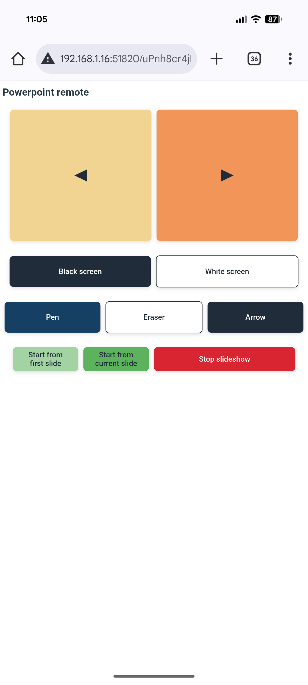

# ppt_remote

Webapp to turn your phone into a simple -and somewhat secure against interference - remote control for PowerPoint presentations.

It was originally written to use my smartphone as a remote control via the local network for the lessons I was taching with a PowerPoint presentation. To prevent snooping from my students and any voluntary interference with my lesson, I randomized everything I could on the app : port, page name, and callbacks.

## First steps

1. Download repo and install requirements with `pip install -r requirements.txt` 
2. Make sure to have both devices on the same network
3. Launch the app with `python main.py`

4. Scan the qr code in the console to access the webapp

## Under the hood

Sends keyboard input to your computer running PowerPoint from a webapp on your smartphone. 
Python/Flask backend.

